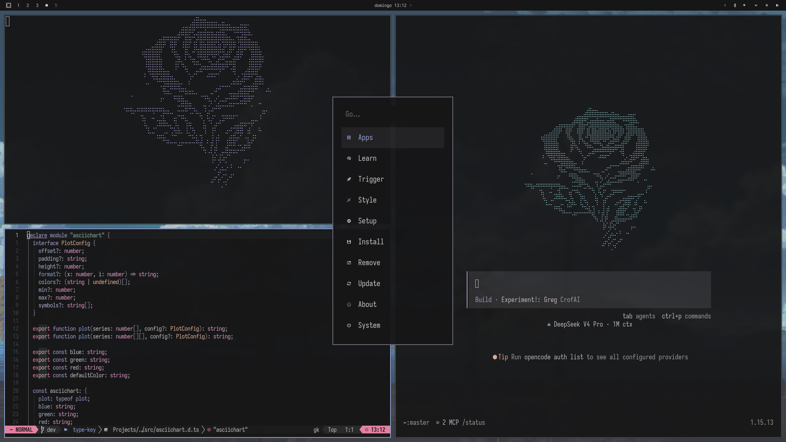

# 🏡 Dotfiles — Omarchy + Hyprland

Mis configuraciones de sistema para [Omarchy](https://omarchy.org/), una distribución Arch Linux con [Hyprland](https://hyprland.org/).

## Stack

| Componente         | Herramienta         |
| ------------------ | ------------------- |
| **WM**             | Hyprland            |
| **Barra**          | Waybar              |
| **Launcher**       | Walker              |
| **Terminal**       | Alacritty / Ghostty |
| **Shell**          | Fish                |
| **Editor**         | Neovim (LazyVim)    |
| **Prompt**         | Starship            |
| **Monitor**        | Btop                |
| **Notificaciones** | Mako                |
| **OSD**            | SwayOSD             |
| **Git TUI**        | Lazygit             |
| **Multiplexor**    | Tmux                |
| **Agente AI**      | Herdr               |
| **Música**         | MPD + rmpc          |

## Themes

Basado en **Kanagawa**. El theme custom se llama `oldwordl` y mantiene los mismos colores.



Los backgrounds se toman directamente de `~/Pictures/wallpapers/` — cualquier wallpaper que metas ahí, el ciclo de fondos lo agarra automáticamente.

## Rápido

```bash
# En una máquina nueva
git clone https://github.com/Juanstudy/dotfiles.git ~/dotfiles
cd ~/dotfiles
omarchy theme set "Oldwordl"
```

## Workflow diario

```bash
# 1. Editás donde siempre
vim ~/.config/hypr/looknfeel.conf

# 2. Subís los cambios
cd ~/dotfiles
git add -A
git commit -m "feat: adjust window gaps"
git push
```

Si agregaste un archivo nuevo (no reemplazaste uno existente):

```bash
# Los configs de ~/.config/ (mpd, rmpc, hypr, etc.)
cd ~/dotfiles && stow --restow -t ~ .config

# El paquete tmux va aparte (vive en tmux/.config/tmux)
cd ~/dotfiles && stow -t ~ tmux
```

> **Ojo:** NO uses `stow --restow -t ~ .` — stowea todo el repo y crearía links basura en tu home (`~/lazygit`, `~/oldworld-preview.png`, `~/tmux`, etc.). El paquete real es `.config`.

## Detalle técnico

Usa [GNU Stow](https://www.gnu.org/software/stow/) para crear symlinks desde `~/dotfiles/` hacia `$HOME/`. Esto significa:

- Editás donde siempre (`~/.config/hypr/...`)
- Los archivos realmente viven en `~/dotfiles/.config/hypr/...`
- Stow mantiene los symlinks sincronizados
- Los archivos del repo (README, bootstrap.sh, .gitignore) se ignoran con `.stow-local-ignore`

### Qué NO está en el repo

- Wallpapers (están en `~/Pictures/wallpapers/`, enlazados via symlink)
- El directorio `current/` de Omarchy (se genera al aplicar un theme)
- Caches y archivos temporales

### Herdr

[Herdr](https://github.com/nicholasgasior/herdr) es un agente de IA que se acopla a paneles de Tmux. Su configuración vive en `~/.config/herdr/config.toml` y está sincronizada vía Stow. Los hooks de Tmux (`tmux/.config/tmux/scripts/hook-adapter.sh`) detectan `HERDR_ENV` para evitar conflictos cuando está activo.

## Créditos

- [oldworld.nvim](https://github.com/dgox16/oldworld.nvim) — palette de colores base del theme `oldwordl`
- [Gentle AI](https://github.com/Gentleman-Programming/gentle-ai) — flujo de trabajo y orquestación usados en este proyecto

## Licencia

Hacé lo que quieras. Si te sirve, joya.
